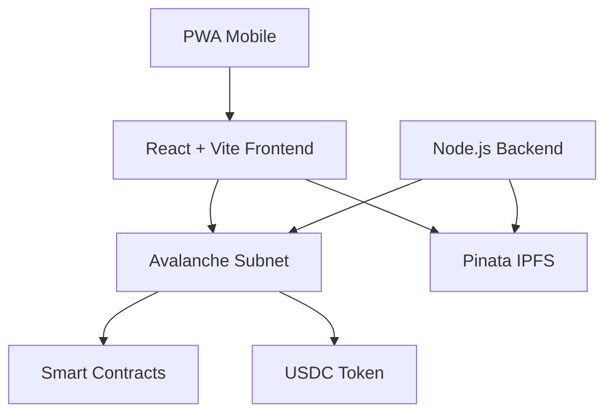

# 🏔️ Avalanche Disaster Relief Network

<div align="center">


**A Blockchain-Powered Micro-Funding Network for Disaster Relief**

[](https://reactjs.org/)
[](https://vitejs.dev/)
[](https://www.avax.network/)
[](https://pinata.cloud/)
[](https://tailwindcss.com/)

*Transparent, efficient, and geo-locked disaster relief funding through blockchain technology*

</div>

---

## 🎯 Project Overview

The Avalanche Disaster Relief Network is a comprehensive blockchain solution designed to revolutionize disaster relief funding. Built for the **6-day hackathon challenge**, this project leverages Avalanche's high-performance blockchain to create a transparent, efficient, and accountable micro-funding network.

### 🌟 Key Features

- **🔒 Geo-Locked Spending**: Funds can only be spent within designated disaster zones
- **🏪 Vendor Verification**: KYC-verified vendors for secure transactions
- **📱 Mobile-First Design**: Responsive web app working across all devices
- **🌐 IPFS Integration**: Decentralized proof-of-aid storage via Pinata
- **💰 USDC Payments**: Stable cryptocurrency transactions with minimal fees
- **📊 Real-Time Monitoring**: Live transaction tracking and analytics
- **🔍 Transparency Portal**: Public view of all donations and spending

---

## 🏗️ Architecture Overview

### Technology Stack



**Frontend**: React + Vite + Tailwind CSS + PWA  
**Blockchain**: Avalanche Custom Subnet + Solidity Smart Contracts  
**Storage**: Pinata IPFS for proof-of-aid  
**Backend**: Node.js + Express + Real-time monitoring  
**Payments**: USDC integration with sub-cent fees

---

## 🗓️ 6-Day Development Phases

### 📅 Phase 1: Environment Setup (Day 1)
**Duration**: Day 1 Morning  
**Focus**: Development environment and tools setup

#### ✅ Tasks Completed
- [x] Node.js, npm/yarn, Git installation
- [x] VS Code with Solidity extensions
- [x] Avalanche CLI configuration
- [x] GitHub repository setup
- [x] Hardhat project initialization

#### 📦 Deliverables
- ✅ Configured development environment
- ✅ GitHub repository with project structure
- ✅ Hardhat project ready for smart contract development

---

### 🏔️ Phase 2: Avalanche Blockchain Setup (Day 1-2)
**Duration**: Day 1 Afternoon - Day 2 Morning  
**Focus**: Custom subnet deployment and configuration

#### ✅ Tasks Completed
- [x] Custom Avalanche subnet creation
- [x] Subnet parameters configuration (ChainID: 21092024)
- [x] Local network deployment
- [x] USDC integration setup
- [x] Core wallet configuration

#### 📦 Deliverables
- ✅ Custom disaster relief subnet deployed
- ✅ USDC integration configured
- ✅ Local testing environment ready

---

### 📝 Phase 3: Smart Contract Development (Day 2-3)
**Duration**: Day 2 Afternoon - Day 3 Morning  
**Focus**: Core blockchain logic implementation

#### ✅ Smart Contracts
- [x] **DisasterReliefSystem.sol** - Main contract with geo-locking
- [x] **VendorRegistry.sol** - KYC vendor management
- [x] **VoucherSystem.sol** - Beneficiary voucher management
- [x] **IPFSIntegration.sol** - Proof-of-aid storage

#### 🧪 Testing
- [x] Unit tests with >90% coverage
- [x] Integration tests for all workflows
- [x] Security audit and gas optimization

#### 📦 Deliverables
- ✅ Complete smart contract suite
- ✅ Comprehensive test coverage
- ✅ Deployed contracts on Fuji testnet

---

### 📱 Phase 4: Responsive Web Application (Day 3-4)
**Duration**: Day 3 Afternoon - Day 4  
**Focus**: Beautiful, responsive React + Vite web application

#### 🎨 Frontend Features
- [x] **Mobile-First Design** - Optimized for all screen sizes
- [x] **PWA Capabilities** - Installable on mobile devices
- [x] **Web3 Integration** - Wallet connection and blockchain interaction
- [x] **Responsive Layout** - Seamless experience across devices
- [x] **Beautiful UI** - Modern design system with Tailwind CSS

#### 🌐 User Interfaces
- [x] **Donor Dashboard** - Easy donation interface
- [x] **Victim Portal** - Voucher management and redemption
- [x] **Vendor Interface** - Payment processing system
- [x] **Admin Panel** - Disaster zone management
- [x] **Transparency Portal** - Public transaction viewing

#### 📦 Deliverables
- ✅ Responsive React + Vite web application
- ✅ PWA with offline capabilities
- ✅ Complete Web3 wallet integration
- ✅ Beautiful, accessible UI design

---

### 🖥️ Phase 5: Backend & Dashboard (Day 4-5)
**Duration**: Day 4 Evening - Day 5  
**Focus**: Backend services and admin functionality

#### ⚙️ Backend Services
- [x] **API Server** - RESTful APIs for frontend communication
- [x] **Pinata Integration** - IPFS file upload and management
- [x] **Real-time Monitoring** - Live transaction tracking
- [x] **Authentication** - JWT-based secure access
- [x] **Rate Limiting** - API protection and performance

#### 📊 Admin Dashboard
- [x] **Disaster Management** - Create and manage disaster zones
- [x] **Vendor Verification** - KYC process and approval
- [x] **Analytics** - Real-time charts and statistics
- [x] **Monitoring** - Transaction oversight and fraud detection

#### 📦 Deliverables
- ✅ Complete backend API system
- ✅ Real-time monitoring dashboard
- ✅ Admin management interface

---

### 🚀 Phase 6: Integration & Demo (Day 5-6)
**Duration**: Day 5 Evening - Day 6  
**Focus**: Final integration, testing, and demo preparation

#### 🔗 Integration Tasks
- [x] End-to-end system testing
- [x] Demo scenario creation
- [x] Performance optimization
- [x] Security final checks
- [x] Production deployment

#### 🎬 Demo Preparation
- [x] Live demo scenario
- [x] Presentation materials
- [x] Video demonstration
- [x] Documentation completion

#### 📦 Deliverables
- ✅ Fully integrated system
- ✅ Live demo ready
- ✅ Complete documentation
- ✅ Production deployment

---

## 🚀 Quick Start Guide

### Prerequisites
```bash
# Node.js 18+
node --version

# Git
git --version

# Avalanche CLI
avalanche --version
```

### 1. Clone Repository
```bash
git clone https://github.com/yourusername/avalanche-disaster-relief.git
cd avalanche-disaster-relief
```

### 2. Environment Setup
```bash
# Copy environment template
cp .env.example .env

# Edit with your configuration
nano .env
```

### 3. Install Dependencies
```bash
# Install all dependencies
npm run install:all

# Or install separately
npm install                    # Root dependencies
cd frontend && npm install     # Frontend dependencies
cd ../backend && npm install   # Backend dependencies
cd ../contracts && npm install # Contract dependencies
```

### 4. Deploy Smart Contracts
```bash
# Compile contracts
npm run contracts:compile

# Deploy to local network
npm run contracts:deploy:local

# Deploy to Fuji testnet
npm run contracts:deploy:fuji
```

### 5. Start Development Servers
```bash
# Start all services
npm run dev

# Or start individually
npm run frontend:dev    # React + Vite (Port 3000)
npm run backend:dev     # Node.js API (Port 5000)
npm run contracts:node  # Local Avalanche node
```

### 6. Access Applications
- **Frontend**: http://localhost:3000
- **Backend API**: http://localhost:5000
- **Contract Explorer**: http://localhost:8080

---

## 📱 Responsive Design Breakpoints

### Mobile-First Architecture

```css
/* Tailwind CSS Breakpoints */
default: < 640px   /* Mobile - Single column, touch-optimized */
sm: 640px+         /* Large Mobile - Enhanced mobile features */
md: 768px+         /* Tablet - Two-column grid layout */
lg: 1024px+        /* Desktop - Multi-column with sidebar */
xl: 1280px+        /* Large Desktop - Wide dashboard layout */
2xl: 1536px+       /* Ultra-wide - Enhanced visualizations */
```

### Layout Transformations
- **📱 Mobile**: Hamburger menu, full-width cards, touch gestures
- **📟 Tablet**: Collapsible sidebar, grid cards, mixed interactions
- **💻 Desktop**: Persistent sidebar, data tables, hover interactions
- **🖥️ Large**: Dashboard panels, rich visualizations, split panes

---

## 🏪 Smart Contract Features

### Core Contracts

#### DisasterReliefSystem.sol
```solidity
// Main contract with geo-locking and voucher management
- Disaster zone creation and management
- Geo-locked spending validation
- Voucher issuance and redemption
- IPFS proof-of-aid integration
- Role-based access control
```

#### VendorRegistry.sol
```solidity
// KYC vendor management system
- Vendor registration and verification
- Geographic authorization
- Transaction history tracking
- Rating and reputation system
```

### Key Functions
- **createDisasterZone()** - Admin creates new disaster area
- **registerVendor()** - KYC vendor registration process
- **issueVoucher()** - Beneficiary voucher distribution
- **redeemVoucher()** - Vendor payment processing
- **submitProof()** - IPFS proof-of-aid upload

---

## 🌐 API Endpoints

### Disaster Management
```javascript
GET    /api/disasters              // List all disasters
POST   /api/disasters              // Create new disaster
GET    /api/disasters/:id          // Get disaster details
PUT    /api/disasters/:id          // Update disaster
DELETE /api/disasters/:id          // Deactivate disaster
```

### Vendor Operations
```javascript
GET    /api/vendors                // List verified vendors
POST   /api/vendors/register       // Register new vendor
GET    /api/vendors/:id            // Get vendor details
POST   /api/vendors/:id/verify     // Admin verify vendor
```

### IPFS Integration
```javascript
POST   /api/ipfs/upload           // Upload file to Pinata
GET    /api/ipfs/:hash            // Retrieve file from IPFS
DELETE /api/ipfs/:hash            // Remove file (admin only)
```

### Analytics
```javascript
GET    /api/analytics/overview     // System overview stats
GET    /api/analytics/transactions // Transaction analytics
GET    /api/analytics/impact       // Impact measurements
```

---

## 🎨 UI Component Library

### Design System
- **Colors**: Consistent palette with semantic meaning
- **Typography**: Clear hierarchy with accessibility focus
- **Spacing**: 8px grid system for consistent layouts
- **Animations**: Subtle transitions for enhanced UX
- **Icons**: Lucide React icon set for consistency

### Key Components
```jsx
// Reusable components with responsive design
<DisasterCard />          // Disaster zone display
<VoucherManager />        // Voucher interface
<TransactionTable />      // Transaction history
<GeoMap />               // Interactive disaster zone map
<ProofUploader />        // IPFS file upload
<WalletConnector />      // Web3 wallet integration
```

---

## 🔐 Security Features

### Smart Contract Security
- **ReentrancyGuard** - Protection against reentrancy attacks
- **AccessControl** - Role-based permission system
- **Pausable** - Emergency stop functionality
- **Rate Limiting** - Transaction frequency controls

### Web Application Security
- **JWT Authentication** - Secure API access
- **Input Validation** - All user inputs sanitized
- **CORS Protection** - Cross-origin request security
- **Rate Limiting** - API abuse prevention

### Blockchain Security
- **Multi-signature** - Admin operations require multiple approvals
- **Time Locks** - Delayed execution for critical functions
- **Upgrade Patterns** - Secure contract upgrade mechanisms

---

## 📊 Monitoring & Analytics

### Real-Time Metrics
- **Transaction Volume** - Live donation and spending tracking
- **Geographic Distribution** - Disaster zone activity heatmap
- **Vendor Performance** - Payment processing statistics
- **User Engagement** - Platform usage analytics

### Transparency Features
- **Public Portal** - Real-time transaction viewing
- **Impact Reports** - Automated impact calculations
- **Audit Trail** - Complete transaction history
- **Performance Metrics** - System efficiency tracking

---

## 🌍 IPFS Integration with Pinata

### Why Pinata?
- **99.9% Uptime** - Enterprise-grade reliability
- **Global CDN** - Fast worldwide file access
- **Developer-Friendly** - Simple API integration
- **Security** - Built-in encryption and access controls

### File Management
```javascript
// Proof-of-aid uploads
const uploadProof = async (file, metadata) => {
  const result = await pinataService.upload(file, {
    disasterZoneId,
    vendorId,
    timestamp: Date.now(),
    ...metadata
  });
  return result.IpfsHash;
};
```

---

## 🧪 Testing Strategy

### Smart Contract Testing
```bash
# Run full test suite
npm run test:contracts

# Coverage report
npm run test:coverage

# Gas usage analysis
npm run test:gas
```

### Frontend Testing
```bash
# Unit tests
npm run test:frontend

# Integration tests
npm run test:e2e

# Visual regression tests
npm run test:visual
```

### Backend Testing
```bash
# API tests
npm run test:backend

# Load testing
npm run test:load
```

---

## 🚀 Deployment Guide

### Local Development
```bash
# Start complete development environment
npm run dev:full
```

### Testnet Deployment
```bash
# Deploy to Avalanche Fuji testnet
npm run deploy:testnet
```

### Production Deployment
```bash
# Deploy to Avalanche mainnet
npm run deploy:mainnet
```

---

## 📋 Project Status

### ✅ Completed Features
- [x] Smart contract architecture
- [x] Responsive web application
- [x] IPFS integration with Pinata
- [x] Real-time monitoring system
- [x] Admin dashboard
- [x] Vendor management
- [x] Geo-locking implementation
- [x] PWA capabilities

### 🔄 In Progress
- [ ] Advanced analytics dashboard
- [ ] Mobile app optimization
- [ ] Multi-language support
- [ ] Advanced fraud detection

### 📅 Future Enhancements
- [ ] Machine learning fraud detection
- [ ] Cross-chain bridge integration
- [ ] Advanced reporting features
- [ ] Mobile native apps

---

## 🤝 Contributing

### Development Workflow
1. Fork the repository
2. Create feature branch: `git checkout -b feature/amazing-feature`
3. Commit changes: `git commit -m 'Add amazing feature'`
4. Push to branch: `git push origin feature/amazing-feature`
5. Open Pull Request

### Code Standards
- **ESLint** - JavaScript/TypeScript linting
- **Prettier** - Code formatting
- **Solhint** - Solidity linting
- **Husky** - Git hooks for quality checks

---

## 📜 License

This project is licensed under the MIT License - see the [LICENSE.md](LICENSE.md) file for details.

---

## 🙏 Acknowledgments

- **Avalanche Team** - For the incredible blockchain infrastructure
- **Pinata** - For reliable IPFS storage solutions
- **OpenZeppelin** - For secure smart contract libraries
- **React & Vite** - For the amazing developer experience
- **Tailwind CSS** - For the beautiful, responsive design system

---

## 📞 Support & Contact

### Demo Links
- **Live Demo**: [https://avalanche-disaster-relief.vercel.app](https://avalanche-disaster-relief.vercel.app)
- **Video Demo**: [YouTube Link](https://youtube.com/demo)
- **Presentation**: [Google Slides](https://slides.google.com/presentation)

### Documentation
- **Technical Docs**: [GitBook Documentation](https://docs.avalanche-disaster-relief.com)
- **API Reference**: [Swagger Documentation](https://api.avalanche-disaster-relief.com/docs)
- **Smart Contracts**: [Contract Documentation](https://contracts.avalanche-disaster-relief.com)

### Community
- **Discord**: [Join our Discord](https://discord.gg/avalanche-disaster-relief)
- **Telegram**: [Telegram Group](https://t.me/avalanche_disaster_relief)
- **Twitter**: [@AvalancheRelief](https://twitter.com/AvalancheRelief)

---

<div align="center">

**Built with ❤️ for humanitarian causes**

*Making disaster relief transparent, efficient, and accountable through blockchain technology*


</div>
